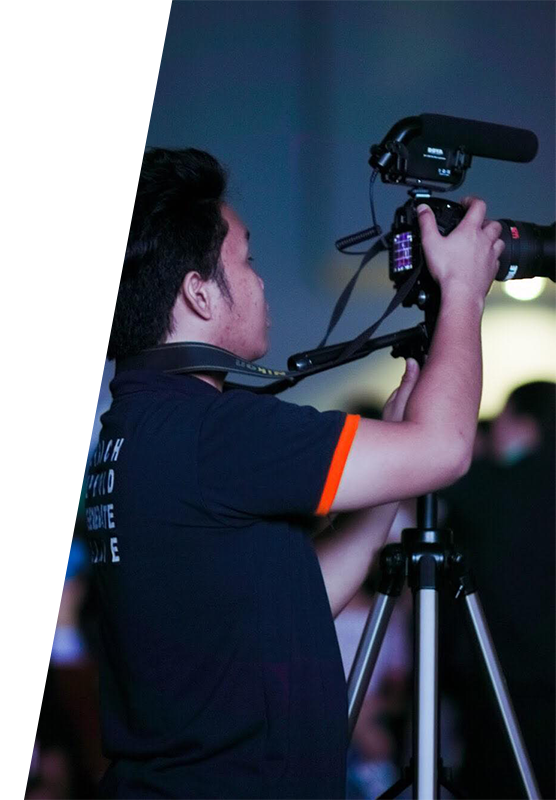

 

# Kristian Allan—@K4IC

> <em> A man living on the edge of time itself. See me speedrunning and clashing through different wars at the last minute. Having pressure always lurking by my side through battles and whose punctuality is rarely found I enter the battleground. Conquering deadlines, delivering satisfaction and withstanding sleep I fight until the last second. </em>

### <b> About Me </b>

 

#### KRISTIAN ALLAN ICAY CABIDA
    Born on May 17, 2000 
    From Roxas City, Capiz, Philippines 
    Takes up Bachelor of Science in Information Technology
    A person who collects, trades, or admires sneakers as a hobby.
> <em> "Life goes on." </em>

# 
 Sneakerhead x Multimedia Hobbyist 

 <em> Me in a nutshell </em> 

  

     
  

  
  

     
  

   ## 
 :movie_camera: Multimedia Hobbyist 

 Sneakerhead - a person who collects, trades, or admires sneakers as a hobby. 
 

 A guy who loves sneakers and cameras. Sneaker collector and also has the love for multiple forms of media. Always updated on the latest trends on sneakers and has a curious mind for Photography and Videography. 

  

## Get in Touch 

*  https://www.facebook.com/_kristianallan_/
*  https://twitter.com/_kristianallan_/
*  https://www.instagram.com/_kristianallan_/

<!--
**K4IC/k4ic** is a ✨ _special_ ✨ repository because its `README.md` (this file) appears on your GitHub profile.

Here are some ideas to get you started: hh

- 🔭 I’m currently working on ...
- 🌱 I’m currently learning ...
- 👯 I’m looking to collaborate on ...
- 🤔 I’m looking for help with ...
- 💬 Ask me about ...
- 📫 How to reach me: ...
- 😄 Pronouns: ...
- ⚡ Fun fact: ...
-->
 
